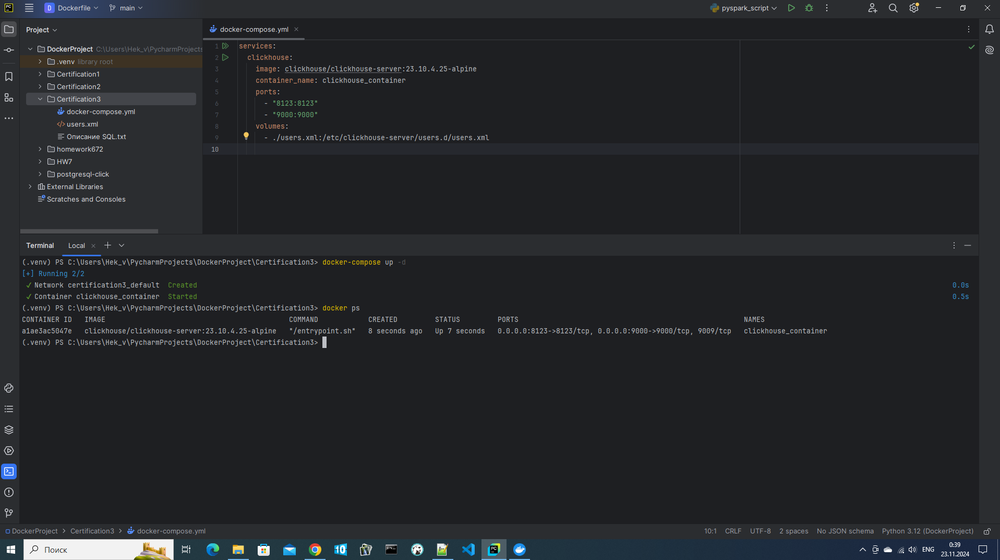
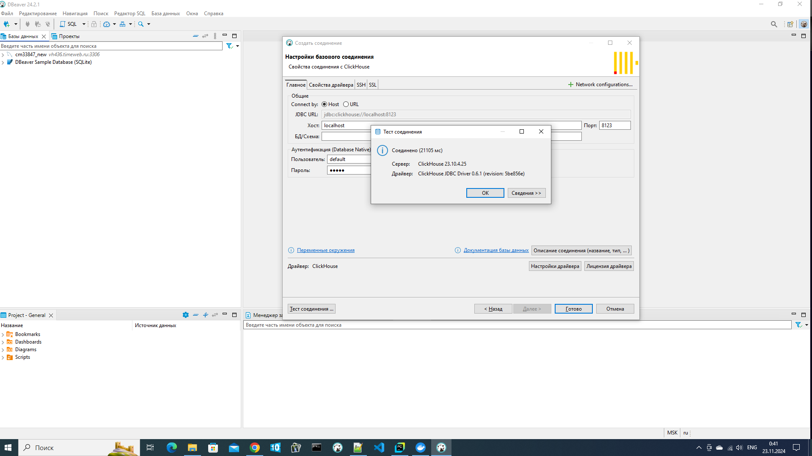
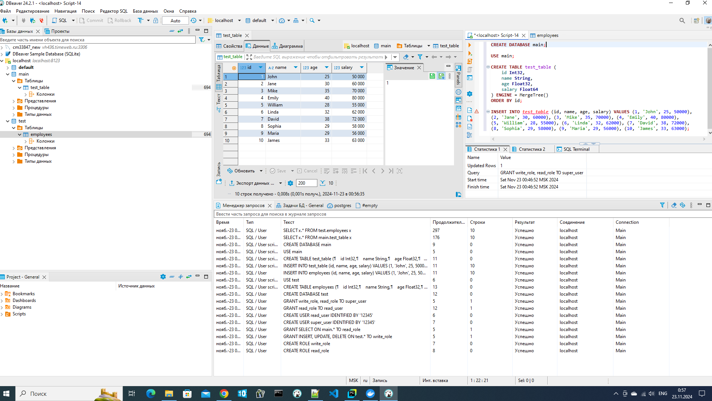
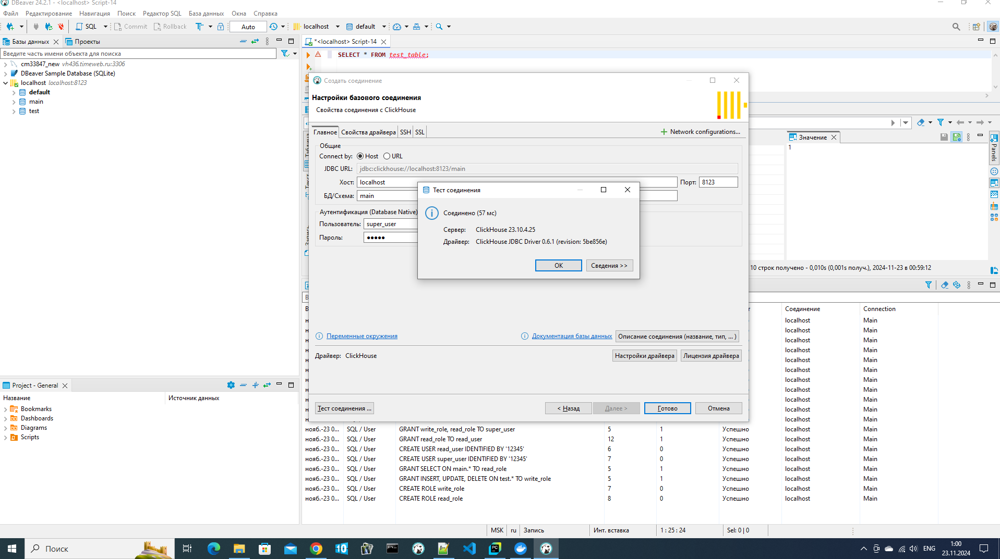
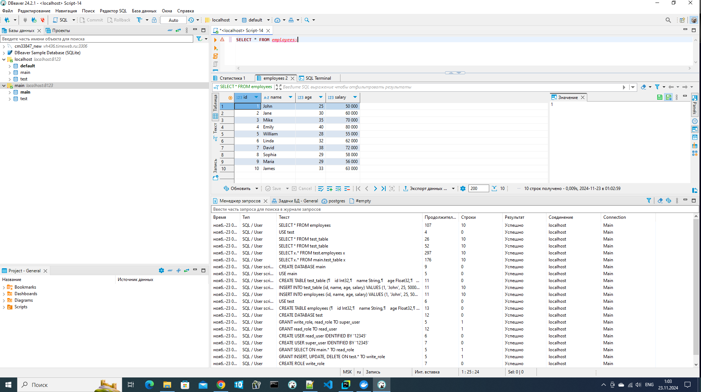
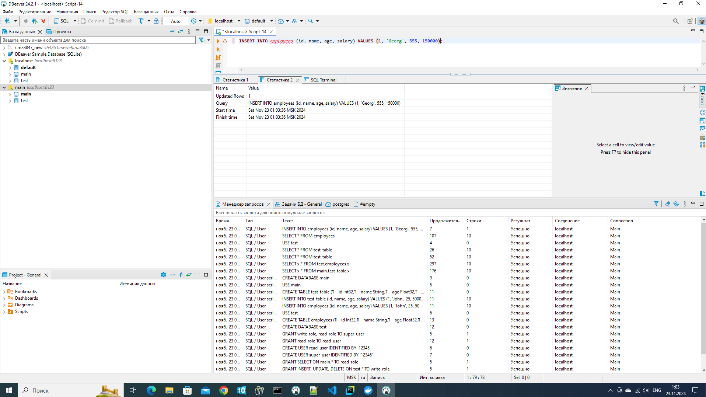
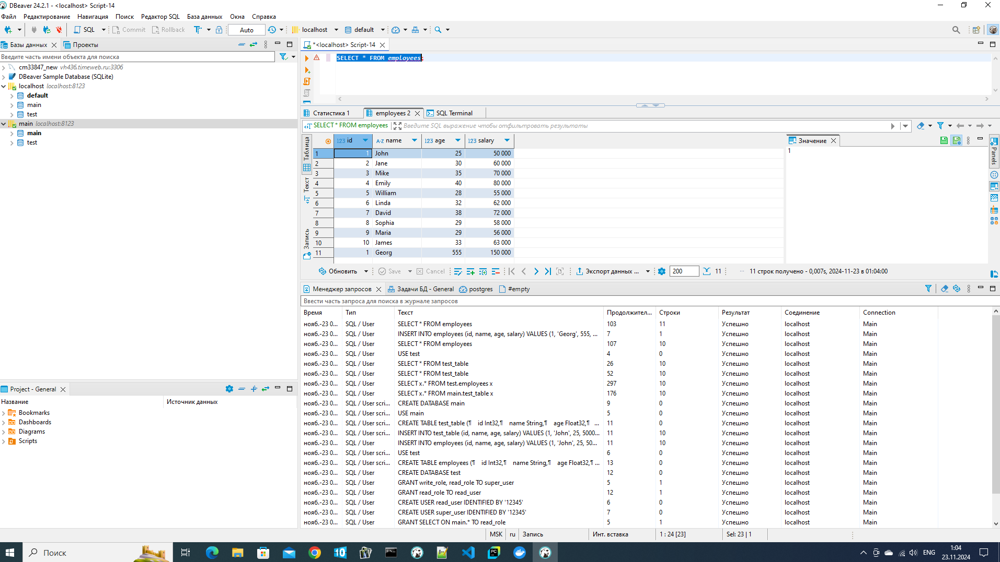
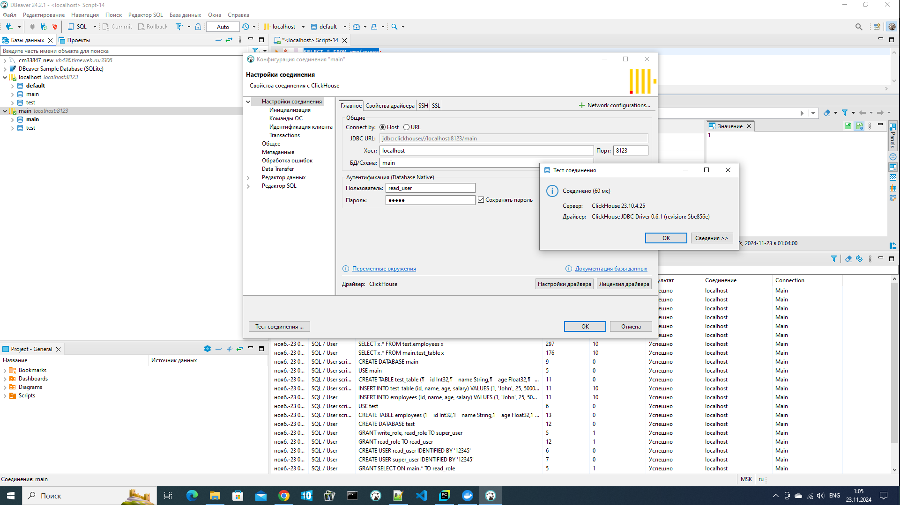
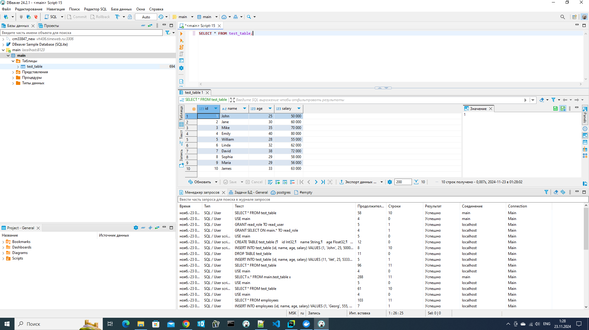
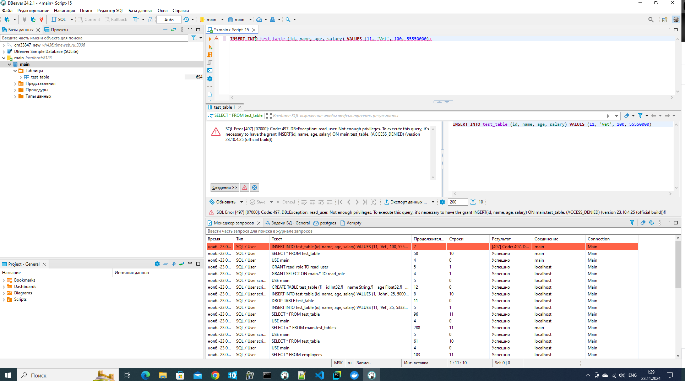

# certification 3 1T (DevOps)
## Задание 3. Создание Docker-контейнера с ClickHouse и SQL
### ClickHouse в Docker, создаем базу данных и настраиваем роли с разными правами доступа с помощью SQL-запросов через DBeaver.

Создаем директорию для проекта и необходимые файлы:

1) docker-compose:
```
services:
  clickhouse:
    image: clickhouse/clickhouse-server:23.10.4.25-alpine
    container_name: clickhouse_container
    ports:
      - "8123:8123"
      - "9000:9000"
    volumes:
      - ./users.xml:/etc/clickhouse-server/users.d/users.xml
```
2) users.xml:
```
<clickhouse>

    <profiles>
        <!-- Default settings. -->
        <default>
        </default>

        <!-- Profile that allows only read queries. -->
        <readonly>
            <readonly>1</readonly>
        </readonly>
    </profiles>

    <!-- Users and ACL. -->
    <users>
        <!-- If user name was not specified, 'default' user is used. -->
        <default>

            <password>12345</password>
            <access_management>1</access_management>
            
            <networks>
                <ip>::/0</ip>
            </networks>

            <!-- Settings profile for user. -->
            <profile>default</profile>

            <!-- Quota for user. -->
            <quota>default</quota>

            <!-- User can create other users and grant rights to them. -->
            <!-- <access_management>1</access_management> -->
        </default>
    </users>

    <!-- Quotas. -->
    <quotas>
        <!-- Name of quota. -->
        <default>
            <!-- Limits for time interval. You could specify many intervals with different limits. -->
            <interval>
                <!-- Length of interval. -->
                <duration>3600</duration>

                <!-- No limits. Just calculate resource usage for time interval. -->
                <queries>0</queries>
                <errors>0</errors>
                <result_rows>0</result_rows>
                <read_rows>0</read_rows>
                <execution_time>0</execution_time>
            </interval>
        </default>
    </quotas>
</clickhouse>
```

Здесь нас интересует строчка ***<access_management>1</access_management>*** и значение 1 которое включает SQL-ориентированное управление доступом для пользователя `default`. Также задаём пароль `12345`)

Запускаем `docker-compose up -d` и убежаемся, что все встало без проблем `docker ps`:



Далее открываем DBeaver, подключаемся к нашей базе (пользователь "default" пароль "12345")



После удачного подключения, создаем 2 новые базы `test` и `main`, наполняем их данными:

```
CREATE DATABASE test;
USE test;
CREATE TABLE employees (
    id Int32,
    name String,
    age Float32,
    salary Float64
) ENGINE = MergeTree()
ORDER BY id;

INSERT INTO employees (id, name, age, salary) VALUES (1, 'John', 25, 50000),
 (2, 'Jane', 30, 60000), (3, 'Mike', 35, 70000), (4, 'Emily', 40, 80000),
 (5, 'William', 28, 55000), (6, 'Linda', 32, 62000), (7, 'David', 38, 72000),
 (8, 'Sophia', 29, 58000), (9, 'Maria', 29, 56000), (10, 'James', 33, 63000);

CREATE DATABASE main;
USE main;
CREATE TABLE test_table (
    id Int32,
    name String,
    age Float32,
    salary Float64
) ENGINE = MergeTree()
ORDER BY id;

INSERT INTO test_table (id, name, age, salary) VALUES (1, 'John', 25, 50000),
(2, 'Jane', 30, 60000), (3, 'Mike', 35, 70000), (4, 'Emily', 40, 80000),
(5, 'William', 28, 55000), (6, 'Linda', 32, 62000), (7, 'David', 38, 72000),
(8, 'Sophia', 29, 58000), (9, 'Maria', 29, 56000), (10, 'James', 33, 63000);
```

Для настройки ролей и пользователей в системе управления базами данных сначала создадим 2 роли read_role и write_role:
```
CREATE ROLE read_role;
CREATE ROLE write_role;
```

Назначаем привилегии `SELECT` роли `read_role` для всех таблиц в базе `main` и назначаем привилегии `INSERT`, `UPDATE` и `DELETE` роли `write_role` для всех таблиц в базе `test':
```
GRANT SELECT ON main.* TO read_role;
GRANT INSERT, UPDATE, DELETE ON test.* TO write_role;
```

Создаем 2-х пользователей
```
CREATE USER super_user IDENTIFIED BY '12345';
CREATE USER read_user IDENTIFIED BY '12345';
```

Теперь назначаем роль `read_role` пользователю `read_user` (он сможет выполнять только `SELECT` в базе `main`)
А пользователю `super_user` назначаем роли `write_role` и `read_role` (он сможет выполнять `SELECT`, `INSERT`, `UPDATE` и `DELETE` в обоих базах)
```
GRANT read_role TO read_user;
GRANT write_role, read_role TO super_user;
```

Все запросы выполнены успешно!)




Теперь создаем новое подключение! К базе `main` пользователь `super_user`:



Проверяем, что `SELECT` и `INSERT` работают, в том числе и в базе test:
```
SELECT * FROM test_table;
USE test;
SELECT * FROM employees;
INSERT INTO employees (id, name, age, salary) VALUES (1, 'Georg', 555, 150000);
SELECT * FROM employees;
```




Теперь к самому интересному, создаем новое соединение к базе `main` пользователь `read_user`:



Обращаем внимание, что других баз для этого пользователя вообще не существует)))
Делаем запросы, проверяем `SELECT`, потом пробуем добавить данные и получаем ошибку!)))
```
SELECT * FROM test_table;
INSERT INTO test_table (id, name, age, salary) VALUES (1, 'Georg', 555, 150000);
```



